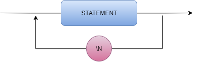

# Compilador-LM

### Expression

 

### Factor

 

### Rel Expression

 

### Statement

 

### Statements

 

### Term

 

### Compiler EBNF

statements = statement {\n , statement };

statement =  | num, "=", ecpression | print, expression, while, rel_expression, statements, wend | if, rel_expression, if, statements, {else, statements}, end, if; 

print = "print", expression ;

expression = term, { ("+" | "-" | or), term } ;

rel_expression = expression, { ("=" | ">" | <), expression } ;

term = fator, { ("*" | "/"| and), fator } ;

fator = ("+" | "-" | not), fator | num | "(", expression, ")" | identifier |input ;

identifier = letter, { letter | digit | "_" } ;

assignment = identifier, "=", expression ;

num = digit, { digit } ;

letter = ( a | ... | z | A | ... | Z ) ;

digit = ( 1 | 2 | 3 | 4 | 5 | 6 | 7 | 8 | 9 | 0 ) ;
