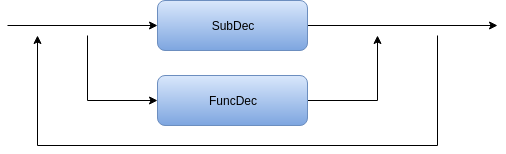

# Compilador-LM

### Program

 

### Statement

 

### Rel Expression

 

### Expression

 

### Term

 

### Factor

 

### Type

 

### Compiler EBNF

program 
    : SUB, MAIN, "(", ")", endline {statement, endline}, END, SUB
    ;

statement   
    : IF, rel_expression, THEN, endline, {statement, endline}* ,{else, endline, {statement, endline}} , END , IF 
    | identifier, "=", rel_expression 
    | print, rel_expression
    | DIN, identifier, AS, type
    | WHILE, rel_expression, endline, {statement, endline}*, WEND 
    ;

rel_expression 
    : expression, { ("=" | ">" | <), expression } 
    ;

expression 
    : term, { ("+" | "-" | or), term } 
    ;

term 
    : fator, { ("*" | "/"| and), fator } 
    ;

factor 
    : ("+" | "-" | not), fator 
    | num 
    | "(", rel_expression, ")" 
    | identifier 
    | input 
    | (True | False)
    ;

identifier 
    : letter, { letter | digit | "_" } 
    ;

type
    : (Integer | boolean)
    ;

assignment 
    : identifier, "=", expression 
    ;

print 
    : "print", expression 
    ;

num 
    : digit, { digit } 
    ;

endline 
    : \n

letter 
    : ( a | ... | z | A | ... | Z ) 
    ;

digit 
    : ( 1 | 2 | 3 | 4 | 5 | 6 | 7 | 8 | 9 | 0 ) 
    ;
