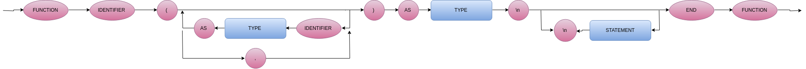

# Compilador-LM

### Program

 

### FuncDec

 

### SubDec

 

### Statement

 

### Rel Expression

 

### Expression

 

### Term

 

### Factor

 

### Type

 

### Compiler EBNF

program  
    : func_dec | sub_dec 
    ; 

func_dec = "FUNCTION", identifier, "(", {(identifier, "AS", type) | ;}*, ")", "AS", type, "\n", {(statement, "\n")}*, "END", "FUNCTION" ;

sub_dec = "SUB", identifier, "(", {(identifier, "AS", type) | ;}*, ")", "\n", {(statement, "\n")}*, "END", "SUB" ;

statement   
    : IF, rel_expression, THEN, endline, {statement, endline}* ,{else, endline, {statement, endline}} , END , IF  
    | identifier, "=", rel_expression  
    | print, rel_expression 
    | DIN, identifier, AS, type 
    | WHILE, rel_expression, endline, {statement, endline}*, WEND  
    | CALL, identifier, (, {(rel_expression| ;)}* , )
    ;

rel_expression  
    : expression, { ("=" | ">" | <), expression }  
    ; 

expression  
    : term, { ("+" | "-" | or), term }  
    ; 

term  
    : fator, { ("*" | "/"| and), fator }  
    ; 

factor  
    : ("+" | "-" | not), fator  
    | num  
    | "(", rel_expression, ")"  
    | {identifier | (, {rel_expression , ;}* ,)} 
    | input  
    | (True | False) 
    ; 

identifier  
    : letter, { letter | digit | "_" }   
    ; 

type 
    : (Integer | boolean) 
    ; 

assignment  
    : identifier, "=", rel_expression  
    ; 

print  
    : "print", rel_expression  
    ; 

num  
    : digit, { digit }  
    ; 

endline  
    : \n 

letter  
    : ( a | ... | z | A | ... | Z )  
    ; 

digit  
    : ( 1 | 2 | 3 | 4 | 5 | 6 | 7 | 8 | 9 | 0 )  
    ; 
